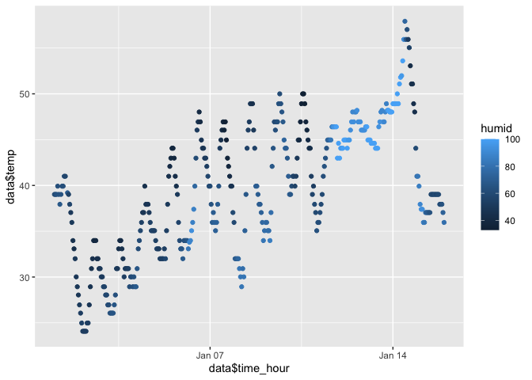

p8105_hw1_sc5352.Rmd
================
Chrissy Chen
2023-09-17

## Problem 1

``` r
#install.packages("moderndive")
library(moderndive)
library(tidyverse)
```

    ## ── Attaching core tidyverse packages ──────────────────────── tidyverse 2.0.0 ──
    ## ✔ dplyr     1.1.3     ✔ readr     2.1.4
    ## ✔ forcats   1.0.0     ✔ stringr   1.5.0
    ## ✔ ggplot2   3.4.3     ✔ tibble    3.2.1
    ## ✔ lubridate 1.9.2     ✔ tidyr     1.3.0
    ## ✔ purrr     1.0.2     
    ## ── Conflicts ────────────────────────────────────────── tidyverse_conflicts() ──
    ## ✖ dplyr::filter() masks stats::filter()
    ## ✖ dplyr::lag()    masks stats::lag()
    ## ℹ Use the conflicted package (<http://conflicted.r-lib.org/>) to force all conflicts to become errors

``` r
library(Hmisc)
```

    ## 
    ## Attaching package: 'Hmisc'
    ## 
    ## The following objects are masked from 'package:dplyr':
    ## 
    ##     src, summarize
    ## 
    ## The following objects are masked from 'package:base':
    ## 
    ##     format.pval, units

``` r
data = get("early_january_weather")
summary(data)
```

    ##     origin               year          month        day              hour      
    ##  Length:358         Min.   :2013   Min.   :1   Min.   : 1.000   Min.   : 0.00  
    ##  Class :character   1st Qu.:2013   1st Qu.:1   1st Qu.: 4.000   1st Qu.: 6.00  
    ##  Mode  :character   Median :2013   Median :1   Median : 8.000   Median :11.50  
    ##                     Mean   :2013   Mean   :1   Mean   : 8.039   Mean   :11.53  
    ##                     3rd Qu.:2013   3rd Qu.:1   3rd Qu.:12.000   3rd Qu.:17.75  
    ##                     Max.   :2013   Max.   :1   Max.   :15.000   Max.   :23.00  
    ##                                                                                
    ##       temp            dewp           humid           wind_dir    
    ##  Min.   :24.08   Min.   : 8.96   Min.   : 32.86   Min.   :  0.0  
    ##  1st Qu.:33.98   1st Qu.:19.94   1st Qu.: 51.34   1st Qu.:140.0  
    ##  Median :39.02   Median :26.06   Median : 61.67   Median :240.0  
    ##  Mean   :39.58   Mean   :28.06   Mean   : 65.48   Mean   :208.2  
    ##  3rd Qu.:44.96   3rd Qu.:35.06   3rd Qu.: 78.68   3rd Qu.:290.0  
    ##  Max.   :57.92   Max.   :53.06   Max.   :100.00   Max.   :360.0  
    ##                                                   NA's   :5      
    ##    wind_speed       wind_gust         precip            pressure   
    ##  Min.   : 0.000   Min.   :16.11   Min.   :0.000000   Min.   :1011  
    ##  1st Qu.: 5.754   1st Qu.:19.56   1st Qu.:0.000000   1st Qu.:1018  
    ##  Median : 8.055   Median :21.86   Median :0.000000   Median :1022  
    ##  Mean   : 8.226   Mean   :22.53   Mean   :0.002039   Mean   :1023  
    ##  3rd Qu.:11.508   3rd Qu.:25.32   3rd Qu.:0.000000   3rd Qu.:1027  
    ##  Max.   :24.166   Max.   :31.07   Max.   :0.190000   Max.   :1034  
    ##                   NA's   :308                        NA's   :38    
    ##      visib          time_hour                     
    ##  Min.   : 0.120   Min.   :2013-01-01 01:00:00.00  
    ##  1st Qu.: 9.000   1st Qu.:2013-01-04 19:15:00.00  
    ##  Median :10.000   Median :2013-01-08 12:30:00.00  
    ##  Mean   : 8.515   Mean   :2013-01-08 12:28:09.39  
    ##  3rd Qu.:10.000   3rd Qu.:2013-01-12 05:45:00.00  
    ##  Max.   :10.000   Max.   :2013-01-15 23:00:00.00  
    ## 

``` r
describe(data)
```

    ## data 
    ## 
    ##  15  Variables      358  Observations
    ## --------------------------------------------------------------------------------
    ## origin 
    ##        n  missing distinct    value 
    ##      358        0        1      EWR 
    ##               
    ## Value      EWR
    ## Frequency  358
    ## Proportion   1
    ## --------------------------------------------------------------------------------
    ## year 
    ##        n  missing distinct     Info     Mean      Gmd 
    ##      358        0        1        0     2013        0 
    ##                
    ## Value      2013
    ## Frequency   358
    ## Proportion    1
    ## --------------------------------------------------------------------------------
    ## month 
    ##        n  missing distinct     Info     Mean      Gmd 
    ##      358        0        1        0        1        0 
    ##               
    ## Value        1
    ## Frequency  358
    ## Proportion   1
    ## --------------------------------------------------------------------------------
    ## day 
    ##        n  missing distinct     Info     Mean      Gmd      .05      .10 
    ##      358        0       15    0.996    8.039    4.969        1        2 
    ##      .25      .50      .75      .90      .95 
    ##        4        8       12       14       15 
    ##                                                                             
    ## Value          1     2     3     4     5     6     7     8     9    10    11
    ## Frequency     22    24    24    24    24    24    24    24    24    24    24
    ## Proportion 0.061 0.067 0.067 0.067 0.067 0.067 0.067 0.067 0.067 0.067 0.067
    ##                                   
    ## Value         12    13    14    15
    ## Frequency     24    24    24    24
    ## Proportion 0.067 0.067 0.067 0.067
    ## 
    ## For the frequency table, variable is rounded to the nearest 0
    ## --------------------------------------------------------------------------------
    ## hour 
    ##        n  missing distinct     Info     Mean      Gmd      .05      .10 
    ##      358        0       24    0.998    11.53        8     1.00     2.00 
    ##      .25      .50      .75      .90      .95 
    ##     6.00    11.50    17.75    21.00    22.00 
    ## 
    ## lowest :  0  1  2  3  4, highest: 19 20 21 22 23
    ## --------------------------------------------------------------------------------
    ## temp 
    ##        n  missing distinct     Info     Mean      Gmd      .05      .10 
    ##      358        0       42    0.998    39.58    8.067    28.04    30.02 
    ##      .25      .50      .75      .90      .95 
    ##    33.98    39.02    44.96    48.02    48.92 
    ## 
    ## lowest : 24.08 24.98 26.06 26.96 28.04, highest: 53.6  55.04 55.94 57.02 57.92
    ## --------------------------------------------------------------------------------
    ## dewp 
    ##        n  missing distinct     Info     Mean      Gmd      .05      .10 
    ##      358        0       49    0.999    28.06     12.1    12.92    15.08 
    ##      .25      .50      .75      .90      .95 
    ##    19.94    26.06    35.06    44.96    44.96 
    ## 
    ## lowest : 8.96  10.04 10.94 12.02 12.92, highest: 50    51.08 51.8  51.98 53.06
    ## --------------------------------------------------------------------------------
    ## humid 
    ##        n  missing distinct     Info     Mean      Gmd      .05      .10 
    ##      358        0      206    0.999    65.48    21.43    39.67    43.35 
    ##      .25      .50      .75      .90      .95 
    ##    51.34    61.67    78.68    96.63   100.00 
    ## 
    ## lowest : 32.86 32.93 33.55 33.88 34.21, highest: 95.99 96.02 96.63 96.73 100  
    ## --------------------------------------------------------------------------------
    ## wind_dir 
    ##        n  missing distinct     Info     Mean      Gmd      .05      .10 
    ##      353        5       35    0.997    208.2    125.3        0        0 
    ##      .25      .50      .75      .90      .95 
    ##      140      240      290      330      340 
    ## 
    ## lowest :   0  10  20  30  40, highest: 320 330 340 350 360
    ## --------------------------------------------------------------------------------
    ## wind_speed 
    ##        n  missing distinct     Info     Mean      Gmd      .05      .10 
    ##      358        0       18    0.992    8.226    5.188    0.000    0.000 
    ##      .25      .50      .75      .90      .95 
    ##    5.754    8.055   11.508   13.809   14.960 
    ## 
    ## 0 (39, 0.109), 3.45234 (16, 0.045), 4.60312 (33, 0.092), 5.7539 (38, 0.106),
    ## 6.90468 (31, 0.087), 8.05546 (39, 0.109), 9.20624 (27, 0.075), 10.35702 (31,
    ## 0.087), 11.5078 (36, 0.101), 12.65858 (19, 0.053), 13.80936 (17, 0.047),
    ## 14.96014 (15, 0.042), 16.11092 (5, 0.014), 17.2617 (5, 0.014), 18.41248 (4,
    ## 0.011), 20.71404 (1, 0.003), 21.86482 (1, 0.003), 24.16638 (1, 0.003)
    ## 
    ## For the frequency table, variable is rounded to the nearest 0
    ## --------------------------------------------------------------------------------
    ## wind_gust 
    ##        n  missing distinct     Info     Mean      Gmd      .05      .10 
    ##       50      308       13    0.984    22.53    4.166    17.26    18.41 
    ##      .25      .50      .75      .90      .95 
    ##    19.56    21.86    25.32    27.62    27.62 
    ##                                                                          
    ## Value      16.11092 17.26170 18.41248 19.56326 20.71404 21.86482 23.01560
    ## Frequency         2        2        5        5       10        2        4
    ## Proportion     0.04     0.04     0.10     0.10     0.20     0.04     0.08
    ##                                                                 
    ## Value      24.16638 25.31716 26.46794 27.61872 28.76950 31.07106
    ## Frequency         2        8        4        4        1        1
    ## Proportion     0.04     0.16     0.08     0.08     0.02     0.02
    ## 
    ## For the frequency table, variable is rounded to the nearest 0
    ## --------------------------------------------------------------------------------
    ## precip 
    ##        n  missing distinct     Info     Mean      Gmd      .05      .10 
    ##      358        0       10    0.128 0.002039 0.003988        0        0 
    ##      .25      .50      .75      .90      .95 
    ##        0        0        0        0        0 
    ##                                                                       
    ## Value       0.00  0.01  0.02  0.03  0.04  0.05  0.06  0.07  0.09  0.19
    ## Frequency    342     3     4     1     2     2     1     1     1     1
    ## Proportion 0.955 0.008 0.011 0.003 0.006 0.006 0.003 0.003 0.003 0.003
    ## 
    ## For the frequency table, variable is rounded to the nearest 0
    ## --------------------------------------------------------------------------------
    ## pressure 
    ##        n  missing distinct     Info     Mean      Gmd      .05      .10 
    ##      320       38      161        1     1023      6.4     1014     1016 
    ##      .25      .50      .75      .90      .95 
    ##     1018     1022     1027     1030     1032 
    ## 
    ## lowest : 1010.8 1011.4 1011.9 1012   1012.1, highest: 1033.5 1033.6 1033.8 1034   1034.4
    ## --------------------------------------------------------------------------------
    ## visib 
    ##        n  missing distinct     Info     Mean      Gmd      .05      .10 
    ##      358        0       14    0.585    8.515     2.45      0.5      2.5 
    ##      .25      .50      .75      .90      .95 
    ##      9.0     10.0     10.0     10.0     10.0 
    ##                                                                             
    ## Value       0.12  0.25  0.50  1.00  1.50  2.00  2.50  3.00  5.00  6.00  7.00
    ## Frequency      2     7    13     3     2     4     6    12     2    16     6
    ## Proportion 0.006 0.020 0.036 0.008 0.006 0.011 0.017 0.034 0.006 0.045 0.017
    ##                             
    ## Value       8.00  9.00 10.00
    ## Frequency      5    13   267
    ## Proportion 0.014 0.036 0.746
    ## 
    ## For the frequency table, variable is rounded to the nearest 0
    ## --------------------------------------------------------------------------------
    ## time_hour 
    ##                   n             missing            distinct                Info 
    ##                 358                   0                 358                   1 
    ##                Mean                 Gmd                 .05                 .10 
    ## 2013-01-08 12:28:09              431015 2013-01-01 19:51:00 2013-01-02 13:42:00 
    ##                 .25                 .50                 .75                 .90 
    ## 2013-01-04 19:15:00 2013-01-08 12:30:00 2013-01-12 05:45:00 2013-01-14 11:18:00 
    ##                 .95 
    ## 2013-01-15 05:09:00 
    ## 
    ## lowest : 2013-01-01 01:00:00 2013-01-01 02:00:00 2013-01-01 03:00:00 2013-01-01 04:00:00 2013-01-01 05:00:00
    ## highest: 2013-01-15 19:00:00 2013-01-15 20:00:00 2013-01-15 21:00:00 2013-01-15 22:00:00 2013-01-15 23:00:00
    ## --------------------------------------------------------------------------------

``` r
# Get the variable names in the dataset
var_name = variable.names(data)
var_name
```

    ##  [1] "origin"     "year"       "month"      "day"        "hour"      
    ##  [6] "temp"       "dewp"       "humid"      "wind_dir"   "wind_speed"
    ## [11] "wind_gust"  "precip"     "pressure"   "visib"      "time_hour"

``` r
# Get the number of rows and columns in the dataset
nrow(data)
```

    ## [1] 358

``` r
ncol(data)
```

    ## [1] 15

``` r
# The mean temperature
mean(data$temp)
```

    ## [1] 39.58212

``` r
#scatterplot
scatterplot = ggplot(data, aes(x = data$time_hour, y = data$temp, color = humid)) + geom_point()
scatterplot
```

    ## Warning: Use of `data$time_hour` is discouraged.
    ## ℹ Use `time_hour` instead.

    ## Warning: Use of `data$temp` is discouraged.
    ## ℹ Use `temp` instead.

<!-- -->

``` r
ggsave("scatterplot.pdf", plot = scatterplot)
```

    ## Saving 7 x 5 in image

    ## Warning: Use of `data$time_hour` is discouraged.
    ## ℹ Use `time_hour` instead.
    ## Use of `data$temp` is discouraged.
    ## ℹ Use `temp` instead.

## Problem 2

``` r
df = tibble(
  vec_num = rnorm(10),
  vec_logical = vec_num > 0,
  vec_char = c("1","2","3","4","5","6","7","8","9","0"),
  vec_factor = factor(c("high","median","low","high","median","low","high","median","low","high"))
)
df
```

    ## # A tibble: 10 × 4
    ##    vec_num vec_logical vec_char vec_factor
    ##      <dbl> <lgl>       <chr>    <fct>     
    ##  1  0.302  TRUE        1        high      
    ##  2 -0.726  FALSE       2        median    
    ##  3  0.301  TRUE        3        low       
    ##  4  1.05   TRUE        4        high      
    ##  5 -0.0476 FALSE       5        median    
    ##  6  0.207  TRUE        6        low       
    ##  7  1.01   TRUE        7        high      
    ##  8 -0.470  FALSE       8        median    
    ##  9  0.398  TRUE        9        low       
    ## 10  1.15   TRUE        0        high

``` r
mean(df$vec_num)
```

    ## [1] 0.3171167

``` r
mean(as.numeric(df$vec_logical))
```

    ## [1] 0.7

``` r
mean(as.numeric(df$vec_char))
```

    ## [1] 4.5

``` r
mean(as.numeric(df$vec_factor))
```

    ## [1] 1.9
